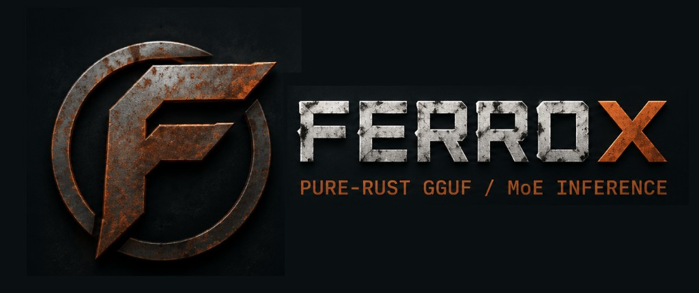

<p align="center">
  
</p>

<p align="center">
  <a href="LICENSE"></a>
</p>

A pure-Rust inference engine for GGUF models — dense and Mixture-of-Experts —
with quantized CPU, Apple Metal, and CUDA backends, a llama.cpp-style CLI,
and an OpenAI-compatible HTTP server.

- **Zero-copy loading** — GGUF weights are mmapped and stay quantized;
  dequantization is fused into the dot products.
- **Fast where it counts** — benchmarked against llama.cpp on the same
  host, backend, and GGUF. CPU decode meets or beats llama.cpp on most
  tested models; Metal is at parity for the Llama family and ahead for
  Qwen. **CLI model load/startup is consistently faster** (mmap path;
  e.g. Llama-8B Metal load Gap ~0.03×, Mistral ~0.07× — Load gap =
  `ferrox_load / llama_load`, same &lt;1 = ferrox better rule as decode).
  Every claim has a pinned receipt in
  [benchmarks/RESULTS.md](benchmarks/RESULTS.md).
- **Broad architecture support** — Llama 3.x, TinyLlama, SmolLM2,
  Qwen2.5/Qwen3 (QKV bias, per-head QK-norm), Gemma-2/3 (softcap / GeGLU /
  SWA), Phi-3/Phi-4 (fused QKV/FFN), OLMoE (MoE). Gemma-4-E2B is fail-closed
  until a dedicated engine. See [docs/MODELS.md](docs/MODELS.md).

## Quick start

```bash
cargo build --release -p ferrox-cli -p ferrox-server --features metal
```

### Download a GGUF

Ferrox loads local `.gguf` files (same format as llama.cpp). Install the
[Hugging Face CLI](https://huggingface.co/docs/huggingface_hub/guides/cli)
(`pip install -U huggingface_hub`), then:

```bash
mkdir -p models

# ~1.2 GB smoke test — filename matches the CLI examples below
hf download TheBloke/TinyLlama-1.1B-Chat-v1.0-GGUF \
  tinyllama-1.1b-chat-v1.0.Q8_0.gguf --local-dir models

# Optional: small instruct chat model (~0.8 GB)
hf download bartowski/Llama-3.2-1B-Instruct-GGUF \
  Llama-3.2-1B-Instruct-Q4_K_M.gguf --local-dir models
```

| Model | Repo | File |
|---|---|---|
| TinyLlama 1.1B Chat Q8_0 | [TheBloke/TinyLlama-1.1B-Chat-v1.0-GGUF](https://huggingface.co/TheBloke/TinyLlama-1.1B-Chat-v1.0-GGUF) | `tinyllama-1.1b-chat-v1.0.Q8_0.gguf` |
| Llama 3.2 1B Instruct Q4_K_M | [bartowski/Llama-3.2-1B-Instruct-GGUF](https://huggingface.co/bartowski/Llama-3.2-1B-Instruct-GGUF) | `Llama-3.2-1B-Instruct-Q4_K_M.gguf` |
| Llama 3.1 8B Instruct Q4_K_M | [bartowski/Meta-Llama-3.1-8B-Instruct-GGUF](https://huggingface.co/bartowski/Meta-Llama-3.1-8B-Instruct-GGUF) | `Meta-Llama-3.1-8B-Instruct-Q4_K_M.gguf` |
| SmolLM2 135M Instruct Q8_0 | [bartowski/SmolLM2-135M-Instruct-GGUF](https://huggingface.co/bartowski/SmolLM2-135M-Instruct-GGUF) | `SmolLM2-135M-Instruct-Q8_0.gguf` |

Browse more GGUFs:
[llama.cpp-compatible models](https://huggingface.co/models?apps=llama.cpp&sort=trending)
on Hugging Face. Prefer `Q4_K_M` for everyday use, `Q8_0` for tiny smokes.
What Ferrox verifies today: [docs/MODELS.md](docs/MODELS.md).

### CLI

```bash
# One-shot completion
./target/release/ferrox -m models/tinyllama-1.1b-chat-v1.0.Q8_0.gguf \
  -p "The capital of France is" -n 32 --temp 0 --no-cnv

# Chat (default when the GGUF ships a chat template), on Metal
./target/release/ferrox -m models/Llama-3.2-1B-Instruct-Q4_K_M.gguf \
  -p "What is 2+2?" -n 64 --temp 0 -dev metal -ngl all
```

Flags mirror llama.cpp (`-m`, `-p`, `-n`, `-t`, `--temp`, `-ngl`, …) —
full reference in [docs/CLI.md](docs/CLI.md).

### Server (OpenAI-compatible API)

```bash
./target/release/ferrox-server \
  -m models/tinyllama-1.1b-chat-v1.0.Q8_0.gguf \
  --host 127.0.0.1 --port 8383 -dev metal -ngl all &

curl -s -X POST http://127.0.0.1:8383/v1/chat/completions \
  -H 'content-type: application/json' \
  -d '{"model":"m","messages":[{"role":"user","content":"Hi"}],"max_tokens":32,"temperature":0}'
```

## Status

| Area | State |
|---|---|
| Dense GQA (CPU / Metal) | Verified — TinyLlama, Llama 3.1/3.2; Llama-8B Metal fair-chat Gap **~0.97×** (CLI **~1.00×**) |
| Qwen2.5 / Qwen3 / SmolLM2 | Verified — Metal ahead of llama.cpp on Host B pins |
| Gemma-2 / Gemma-3 / Phi-3 / Phi-4 | Verified Metal pins; Gemma-4-E2B **refuse** (dedicated engine needed) |
| MoE (CPU / Metal) | Verified — OLMoE; Metal expert placement (still trails llama on Metal MoE) |
| MLA / hybrid GDN | Partial — dense-lead MLA on CLI+server; hybrid loader scaffold only |
| Kimi / GLM / DeepSeek | Partial — primitives and synthetic stacks, no frontier checkpoint e2e |
| CUDA performance | Deferred — suite supports `--backend cuda`; needs GPU host pins |

Benchmark methodology and receipts (decode + CLI load): [benchmarks/RESULTS.md](benchmarks/RESULTS.md)
(`python3 benchmarks/run_suite.py --skip-missing --fit-host`, including `--mode cli`).

## Documentation

| Doc | Contents |
|---|---|
| [docs/CLI.md](docs/CLI.md) | CLI flags and examples |
| [docs/MODELS.md](docs/MODELS.md) | Supported models and verification status |
| [docs/API.md](docs/API.md) | OpenAI-compatible API matrix |
| [docs/CONFIG.md](docs/CONFIG.md) | Environment variables and tuning |
| [docs/AGENTS_COOKBOOK.md](docs/AGENTS_COOKBOOK.md) | Point IDEs / agents at `ferrox-server` |
| [benchmarks/RESULTS.md](benchmarks/RESULTS.md) | Pinned tok/s + CLI load/startup vs llama.cpp |
| [docs/ROADMAP.md](docs/ROADMAP.md) | Planned work |
| [CONTRIBUTING.md](CONTRIBUTING.md) | How to contribute |

## Project layout

```
crates/      ferrox-{gguf,quant,core,moe,models,cli,server,cuda,metal,…}
docs/        CLI, MODELS, CONFIG, ROADMAP, architecture manifest
benchmarks/  suite runner + pinned results
```

## License

Apache-2.0 — see [LICENSE](LICENSE) and
[docs/THIRD_PARTY_NOTICES.md](docs/THIRD_PARTY_NOTICES.md).
