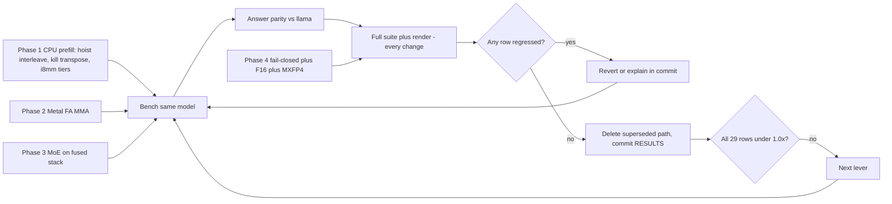

# llama.cpp parity push

> Working plan for closing the measured gaps against
> [`benchmarks/RESULTS.md`](../../benchmarks/RESULTS.md). Re-ranked
> **2026-08-10** from a four-way read-only audit of `ferrox` against
> `.scratch/llama.cpp` (CPU prefill, CPU kernel coverage, Metal, and
> model/weight coverage). Every claim below carries a `file:line`; the two
> load-bearing ones were re-verified by hand before landing this document.
>
> Ordering is by measured gap × known cause, not by phase number. Phase 1
> (CPU prefill) and Phase 4 (coverage) are independent and can proceed in
> parallel. The frontmatter `todos` list is the checklist.

## Where this stands (2026-08-13, ledger regenerated)

The owed suite run is **paid** (`cb27b24`, started at load 1.95). Done and
published: **Phase 1 CPU prefill**, **Metal dense prefill**, **d=64 MMA**,
**d=128 MMA**. Done as correctness/tooling (no row moves): **sealed kernel
registry** (`99a69ab`), **F16 loading** (`7ef74f1`), **prefill-capable
`ferrox verify`** (`bfd1c1a`), **the clippy gate** (`c8a4cc6`).

**21 red rows** (29 at the start of the push, 25 before this run):

| Axis | Red | Worst | Owner |
|---|---|---|---|
| CPU `tg128` | 8 | SmolLM2 2.44× | `cpu-decode-scaling` |
| CPU `pp512` | 6 | Gemma-3-1B 1.65× | `cpu-gemma3-prefill`, then 1a–1d |
| Metal `pp512` | 6 | OLMoE 2.62× | `metal-moe-stack`, `metal-fa-mma-d256` |
| Metal `tg128` | 1 | OLMoE 1.41× | `metal-moe-stack` |

**Dense Metal prefill is finished as a workstream.** Every dense row is
1.02–1.08×, and the d=128 kernel moved Qwen3-0.6B by 76% (1936 → 3400
tok/s). What is left on Metal is MoE and one d=256 row.

### What this run corrected

Both corrections are the same failure: reading the old table instead of
measuring both engines together. The plan already forbids this; it still
happened twice in one session.

- **The pre-08-13 llama CPU column was measured under load and reads
  low.** TinyLlama CPU `tg128`: llama 60.64 → 91.74 while ferrox rose
  55.98 → 61.58 — the row went 1.08× → 1.49× with no ferrox regression.
  Same on OLMoE CPU `tg128` (llama 65.71 → 107.57). Any "regression"
  spanning that boundary needs re-deriving from same-session numbers.
- **Gemma-3-1B CPU `pp512` is 1.65×, not 1.94×** — llama 548 → 468. It is
  still the worst CPU prefill row, but the gap was never as wide as the
  plan's framing assumed.

One real regression: **OLMoE Metal `pp512` 626 → 587 (-6%)**, gap 2.48× →
2.62×. Inside the ~20% host spread, so not conclusive on its own — but it
is the wrong direction on the worst row in the ledger.

### Coverage findings from the 2026-08-13 external study

Two shipped products were read read-only under `.scratch/` (oMLX,
Unsloth). Neither yields a kernel to port — oMLX's forward pass is
mlx-lm's, and Unsloth does not write GGUF at all (it shells out to
llama.cpp). What they yield is a **compatibility checklist against what
is actually published**, and three items on it are correctness bugs:

- **5 of 16 published `UD-*` variants are undecodable.** ggml tags 17,
  21, 22, 29 (`IQ2_XS`, `IQ3_S`, `IQ2_S`, `IQ1_M`) hit
  `GgmlType::Other` in `ferrox-gguf/src/lib.rs`. `IQ3_S` matters most:
  it appears inside `IQ3_M` mixes and inside the low-bit recipes
  `docs/MODELS.md` already claims as targets. Verified by hand against
  the tag table, not taken on the study's word.
- **gpt-oss loads and silently computes the wrong graph.** ferrox
  decodes MXFP4 (tag 39) and routes `gpt-oss` to `generic-gqa`, and
  there is no attention-sink code anywhere in `ferrox-models` or
  `ferrox-core`. Unsloth publishes gpt-oss GGUFs as MXFP4-only. So the
  file loads, runs fast, and is wrong — the `coverage-fail-closed` bug
  class with a widely-distributed model behind it.
- **Stop-token and BOS handling is model-specific in ways ferrox does
  not encode.** gpt-oss `<|end|>` ends every non-final turn and is *not*
  EOG (treating it as one truncates every reply); gemma-4's EOS is
  `<turn|>`; `tokenizer.ggml.token_type == CONTROL(3)` is the authority
  for parseable specials; and Unsloth deliberately strips
  `{{ bos_token }}` from the template it bakes into the GGUF, so a
  loader that renders the template *and* auto-adds BOS double-BOSes.

One structural gap behind all of it: `chat_template.rs` is a six-variant
sniffed enum with hand-written renderers. Every new family falls back to
`Plain`, and the tool-call formats are unreachable without a real Jinja
renderer. `ChatTemplate::Gemma4` was checked and does not implement the
real gemma-4 template.

Nothing here moves a benchmark row. All of it decides whether a model
that loads produces the right tokens.

### Next levers, in order

1. `metal-moe-stack` — OLMoE owns **both** remaining Metal red rows
   (pp512 2.62×, tg128 1.41×) and is the worst row on any backend.
2. `cpu-decode-scaling` — 8 red rows, the only axis with nothing at
   parity, and the cause is already measured (fork-join scaling; ferrox
   beats llama at one thread on Mistral-7B). Retry the persistent pool
   with the `wf/cpu-threadpool` deadlock understood first.
3. `cpu-gemma3-prefill` — the one CPU prefill row that is an outlier
   rather than a trend, still undiagnosed.

## Ledger as of v0.4.0 (2026-08-11, regenerated on Host B)

Phase 1 is complete **and now measured** — it was written on x86, where every
aarch64 kernel compiles out, and sat unmeasured until it ran here.

| Axis | Before | Now | Worst row |
|---|---|---|---|
| Metal `pp512` | 2.33–35.06× | **1.17–2.89×** | SmolLM2 2.89× |
| CPU `pp512` | 3.17–5.82× | **0.94–1.63×** | Gemma-3-1B 1.63× |
| Metal `tg128` | 1.03–2.87× | **0.60–1.46×** (6 of 11 at/ahead) | OLMoE 1.46× |
| CPU `tg128` | 1.13–2.60× | **1.20–1.71×** | OLMoE 1.71× |

Prefill is no longer the headline deficit. **CPU decode is** — behind on every
row, and the only axis with no row at parity. Re-rank accordingly: 2a still
owns the sub-1.5B Metal rows, but the conditional threadpool item under 1f is
now unconditional.

Two things the regenerated ledger surfaced that were not in the plan:

- **Gemma-4-E2B Q4_K_M is slower on Metal than on CPU** (12.86 vs 21.66
  `pp512`). Output is correct, so nothing is broken — the `Gemma4` engine is a
  separate stack that never reaches `launch_prefill_dense_stack`. It is a
  coverage gap, and it is the only model in the suite with no llama comparison.
- **Sub-20% differences in the table are not resolvable.** Suite numbers sit
  below a quieter interleaved `--compare` sweep by up to 15% on the same rows
  (Qwen2.5-0.5B CPU `pp512` 614.59 vs 726.51). Only claim a row moved when it
  moved by more than that.

## Ledger after the MMA port (2026-08-11, commit 356dce1)

Metal `pp512` was the worst axis at 1.7-2.9x. The simdgroup-MMA d=64
flash attention closed it:

| Model | before | now | llama | gap |
|---|---|---|---|---|
| SmolLM2-135M Q8_0 | 4183 | **11729** | 12002 | **1.02x** |
| TinyLlama-1.1B Q8_0 | 1177 | **1975** | 2000 | **1.01x** |
| Qwen2.5-0.5B Q8_0 | 2456 | **4389** | 4904 | 1.12x |
| Llama-3.2-1B Q4_K_M | 1227 | **1746** | 1892 | 1.08x |
| Llama-3.2-1B IQ4_XS | 1228 | **1756** | 1896 | 1.08x |

Confirmed by interleaved A/B on `FERROX_METAL_FA_MMA` before the suite
run: SmolLM2 2.8x, TinyLlama 1.69x, Qwen2.5 1.78x over the scalar kernel.

**Qwen3-0.6B metal is the odd one out at 1.81x** where every other
sub-1.5B dense model moved to ~1.1x. Its head_dim is 128, so it never
takes the new d=64 kernel. Extending MMA to d=128 is the next Metal
target and it is a known-shaped job, not an open question. d=256
(Gemma-3) follows.

Worst remaining rows overall are now **MoE and CPU**, not dense Metal
prefill: OLMoE metal pp512 2.48x, Qwen3-0.6B metal 1.81x (above),
Gemma-3-1B cpu pp512 1.94x.

## d=128 MMA (2026-08-12, commit 0ee4d0b) — every d=128 Metal row closed

The d=64 kernel body is now parameterised over the head dim, so one macro
emits both `gqa_prefill_fa_ext_mma_d64` and `_d128`. Interleaved A/B,
`-p 512 -n 0 -r 3 --ngl 99`, two reps per arm:

| Model | fa_vec | mma | speedup | llama | gap |
|---|---|---|---|---|---|
| Qwen3-0.6B Q8_0 | 1917 | **3277** | 1.71x | 3509.65 | 1.81x -> **1.07x** |
| Phi-4-mini Q4_K_M | 450 | **540** | 1.20x | 561.98 | 1.24x -> **1.04x** |
| Llama-3.2-3B Q4_K_M | 523 | **630** | 1.20x | 563.26 | 1.08x -> **0.89x** |
| Mistral-7B Q4_K_M | 235 | **266** | 1.13x | 256.55 | 1.10x -> **0.97x** |

Greedy output is byte-identical with MMA on and off on Qwen3-0.6B and
Phi-4-mini at a 16-token prompt. `gqa_prefill_fa_ext_mma_d128_matches_cpu_and_fa_vec`
covers padded tails, exact 8-row fits and long-prefix/short-batch.

**Owed: a suite run.** Host B sat at load 2.4-3.5 for the whole session
(user applications), above the 2.0 bar, so `RESULTS.md` was deliberately
not regenerated and still advertises Qwen3-0.6B metal at 1.81x. The A/B
above is interleaved and valid as a *relative* measurement only. Run
`--suite --fit-host --skip-missing` + `--render` on the next quiet window
before any further Metal change, so this and the next change are not
measured together.

Only d=256 (Gemma-3, metal pp512 1.17x) is left without an MMA kernel.
It needs a lane loop in the epilogue: `own` gives each lane one `float4`
of the output row, which caps the macro at D/4 <= 32.

### Rejected: the persistent-threadpool branch

`wf/cpu-threadpool` was implemented and **not merged**. Adversarial review
found a reproducible deadlock in its new public seam, contradicting the
module's own safety argument; its A/B knob did not isolate the change it
existed to measure; and its perf thesis was unverified by the author's own
admission. The diagnosis it rests on is still correct (scaling, not
throughput). Retry with the deadlock understood first — reason explicitly
about `FERROX_CPU_THREADS=1` and rayon nesting before writing code.

### Gaps in our own tooling, found by using it

- ~~**`ferrox verify` passes vacuously on prefill kernels.**~~ **FIXED
  (`bfd1c1a`).** The prompt was fixed at 6 tokens while every batched
  prefill kernel gates on `n_q >= 8`. `--prompt-tokens N` stretches the
  prompt by repeating its body (one BOS kept), `--prompt` overrides the
  text, and the child reports the tokenized length back so every verdict
  ends with `prefill covered` or `decode only`. A vacuous pass is now
  visibly labelled as one.
- ~~**CPU and Metal diverge on longer prompts.**~~ **Did not reproduce
  (2026-08-13).** With the length-aware `verify`, greedy ids are identical
  cpu vs metal at 41 (natural text), 49, 128 and 300 tokens on TinyLlama,
  at 49 and 300 on Phi-4-mini, and at 40 tokens across TinyLlama,
  Phi-4-mini, Llama-3.2-1B (Q4_K_M and IQ4_XS), Llama-3.2-3B, Mistral-7B,
  OLMoE and Gemma-2-2B — the first real-weight coverage of both MMA
  kernels. Either the MMA work fixed it or the original observation was
  logit drift that never flipped an argmax. Not claimed as a fix; reopen
  with a reproducer.

## Every row still >1x, ranked (superseded above; kept for the CPU rows)

The remaining work, in one place. Gap = `llama / ferrox`.

**CPU decode (`tg128`) — 8 rows, nothing at parity. Largest single block.**

| Model | ferrox | llama | gap |
|---|---|---|---|
| OLMoE-1B-7B Q4_0 | 65.72 | 112.08 | 1.71x |
| TinyLlama-1.1B Q8_0 | 53.26 | 87.50 | 1.64x |
| SmolLM2-135M Q8_0 | 110.48 | 176.12 | 1.59x |
| Gemma-3-1B Q8_0 | 45.00 | 61.92 | 1.38x |
| Qwen3-0.6B Q8_0 | 55.47 | 75.08 | 1.35x |
| Phi-4-mini Q4_K_M | 25.69 | 31.67 | 1.23x |
| Qwen2.5-0.5B Q8_0 | 81.15 | 99.63 | 1.23x |
| Mistral-7B Q4_K_M | 16.74 | 20.06 | 1.20x |

Decode is one activation against the whole weight matrix, so it is bandwidth-
and latency-bound, not FLOP-bound: none of the Phase 1 GEMM work touches it.

**MEASURED 2026-08-11 — it is scaling, not per-thread throughput.** Both
engines run back-to-back, no forced `-t` except as the diagnostic variable:

| Model | | ferrox | llama | gap | ferrox 1→6 | llama 1→6 |
|---|---|---|---|---|---|---|
| TinyLlama Q8_0 | t=1 | 38.25 | 43.47 | 1.14x | | |
| | t=6 | 53.73 | 86.34 | 1.61x | **1.40x** | **1.99x** |
| Mistral-7B Q4_K_M | t=1 | 5.87 | 4.75 | **0.81x** | | |
| | t=6 | 17.19 | 20.85 | 1.21x | **2.93x** | **4.39x** |

Per-thread throughput is not the problem — ferrox *beats* llama at one thread
on Mistral-7B. The gap opens as threads are added, on both models. So
**candidate 1 (fork-join overhead) is the cause and candidate 2 is closed**;
the interleave-8 / i8mm decode kernels from PRs #4-#5 did their job.

Headroom, if ferrox matched llama's scaling ratio: TinyLlama 38.25 x 1.99 =
76.1 (gap 1.13x, from 1.61x), Mistral 5.87 x 4.39 = 25.8 — ahead of llama.

Do **not** generalise from SmolLM2-135M. At that size both engines get *slower*
with threads (ferrox 148.79 -> 105.46, llama 226.67 -> 166.78) and the gap is
flat across thread counts, so it looks like a throughput problem and is not.
It is the one row where a thread-count heuristic, not a faster pool, is the fix.

Two candidate causes, now resolved by the measurement above:

1. **Fork-join per matvec.** Decode does one rayon fork-join per weight
   matrix, ~200/token on SmolLM2, and `sample` previously showed workers
   parked in `wait_until_cold`. llama runs a persistent pool that spins on
   `ggml_thread_cpu_relax` before parking (`ggml-cpu.c`, `ggml_barrier`).
   This is the item 1f follow-up, now unconditional. Note the gap is largest
   on the *smallest* models, which is what a fixed per-matvec overhead looks
   like.
2. ~~**Per-thread GEMV throughput.**~~ **Closed by measurement** — ferrox is
   at 1.14x (TinyLlama) and 0.81x (Mistral) at equal thread count. PRs #4-#5
   closed it. Cause 1 is the whole remainder.

**CPU prefill (`pp512`) — 7 rows left, all under 1.7x.**

| Model | gap | note |
|---|---|---|
| Gemma-3-1B Q8_0 | 1.63x | worst remaining; no diagnosis yet |
| OLMoE-1B-7B Q4_0 | 1.33x | MoE, see Phase 4 |
| SmolLM2-135M Q8_0 | 1.25x | smallest model, fixed-overhead shaped |
| Mistral-7B Q4_K_M | 1.14x | |
| Qwen2.5-0.5B Q8_0 | 1.12x | |
| Qwen3-0.6B Q8_0 | 1.08x | |
| Phi-4-mini Q4_K_M | 1.07x | |

TinyLlama is ahead at 0.94x. The four rows at 1.07-1.14x are within a
generous reading of this host's spread and should not be chased individually;
Gemma-3-1B at 1.63x is the one that needs a cause.

**Metal prefill — 5 rows above 1.5x**, all sub-1.5B or MoE: SmolLM2 2.89x,
OLMoE 2.30x, Qwen2.5-0.5B 1.99x, Qwen3-0.6B 1.80x, TinyLlama 1.70x,
IQ4_XS 1.60x, Llama-3.2-1B 1.53x. Owned by 2a, which is blocked on 2a-0.

**Metal decode — 1 row**: OLMoE 1.46x. Everything else is at or ahead of
parity.

## What a survey of two peer Rust engines actually yielded

Both were read at source level, not from their READMEs. The negatives
matter more than the positives, because they close off shortcuts:

- **Neither has a simdgroup-MMA Metal attention or GEMM to port.** Both
  ship scalar "one thread per output cell" Metal kernels whose own header
  comments describe the tiled MMA version as future work — exactly where
  ferrox is. 2a must be written from llama.cpp's `kernel_flash_attn_ext`.
- **Neither helps with CPU decode scaling.** One is GPU-only end to end
  (no CPU backend implementor at all, only a validation oracle); the
  other's kernels are CUDA FFI. There is no peer persistent-threadpool
  design to study; llama.cpp's `ggml_barrier` remains the reference.
- **One's "paged attention" is orchestration only** — the gather kernel
  lives in an unvendored external crate. Portable part is the *contract*,
  not an implementation.
- Its scheduler is FIFO with alternating prefill-only / decode-only steps,
  not true single-step interleaving. Simpler than advertised, and a
  reasonable first target, but it carries no fairness policy to inherit.

Portable and worth taking, in value order:

1. **Sealed kernel-lookup registry** (see below) — smallest, highest hit
   rate against bugs ferrox actually had.
2. **Per-head magnitude-ratio std** as the divergence fingerprint (below).
3. **Paged-KV metadata contract**: a flat block pool with a free-list, a
   per-sequence `block_table: Vec<u32>`, and a `slot_mapping` array of
   physical slots (`block_id * block_size + offset`) built per step, over
   **one pre-sized allocation per layer** rather than OS paging. Page size
   32 on Metal / 64 on CUDA. This is the shape that decouples the KV
   budget from context reserved up front, and it needs no virtual-memory
   tricks. ferrox would still write the gather itself.
4. **Asymmetric K/V precision.** K dominates attention-score accuracy and
   V tolerates far less; pairing a higher-precision K with a lower-
   precision V (per-layer overridable) buys memory that uniform KV quant
   cannot. Pairs with the `turbo3`/WHT work already on the roadmap.
5. **Decode sparse-V gate**: skip V dequant+accumulate entirely where the
   softmax weight is below ~1e-3. Bandwidth win at long context,
   independent of any MMA work.

ferrox already has a prefix cache; the peer implementation (parent-hash
chained block hashing, ref-counted LRU eviction restricted to leaf blocks)
is worth diffing against ours rather than adopting wholesale.

## Debuggability: per-layer divergence, not just per-output

`ferrox verify` (landed) compares greedy token ids between the CPU
reference and a GPU backend. It answers *whether* a backend is wrong. It
does not answer *where*, and that is most of the work: the d=64 softcap
race took a full investigation to localise even though the symptom was
obvious, because the only observable was the final logits.

**Adopt a layer-by-layer divergence comparator, environment-gated so it
costs nothing when off.** The shape that works elsewhere:

- A reference forward in f32 with per-layer hooks, run against the
  backend under test.
- **Per-head magnitude ratio, and watch its standard deviation, not its
  mean.** A mean near 1 with high across-head variance is the fingerprint
  of a pointer/layout bug; precision noise keeps variance low. That single
  distinction separates "wrong indexing" from "expected f16 drift"
  immediately — the call that cost the most time on the d=64 kernel.
  Companions: flat cosine, flat relative-L2, and a best-match-permutation
  cosine, which catches heads computed correctly but written to the wrong
  slot.
- Per layer, per tensor of interest (prenorm hidden state, attention
  output, FFN output, residual sum): magnitude ratio and top-K overlap
  against the reference, not just max-abs-diff — a ratio catches a
  scale bug that an absolute threshold sized for the output tensor
  misses at layer 2.
- Print the first layer whose ratio leaves a band, then stop. That index
  is the diagnosis.
- Gate every dump behind an env var checked once, so the instrumentation
  is not in the hot path when unset (the same `OnceLock` discipline the
  Metal env reads now use).

Also worth taking: **MoE routing dumps** — gate logits, chosen expert ids
and per-expert output magnitudes per layer. MoE is ferrox's worst family
on every axis, and today there is no way to see whether a bad row is a
routing bug or a kernel bug. The Qwen shared-expert bug (40% of the
active FFN silently skipped) is exactly the class of defect this makes
visible immediately, and it went unnoticed until a code audit found it.

Neither is a performance change. Both are prerequisites for doing the
performance changes quickly and for not shipping another green row that
computes the wrong thing.

## Silent-fallback detection (cheap; we keep hitting this)

ferrox's worst bug class this cycle was not a wrong kernel but a *missing*
one, silently replaced by a slow path:

- IQ4_XS batched prefill ran on the **CPU** because `metal_kind_supported`
  and `apply_gpu`'s kind table disagreed — 13.7x on that row, and the only
  symptom was a slow benchmark.
- Gemma-4-E2B is slower on Metal than on CPU: same smell.
- `ferrox-cli --features cuda` did not compile at all, so every CUDA claim
  was untested.

**LANDED (`99a69ab`, `ferrox-core/src/kernel_registry.rs`).** The design,
kept here because the remaining work is to widen its coverage as new
dispatch seams are added — an unrecorded seam is invisible to it. Record
every kernel/dispatch lookup made while constructing the model, with
`#[track_caller]` so each record carries its call site. Seal the registry
once loaded; any later lookup that misses and takes a fallback is a silent
slow path and should fail loudly, or at least warn once. That converts
"why is this row slow" into a startup error. It would have caught all
three of the above at load time instead of via a benchmark and an audit.

## Memory: what actually decides which models fit

Roadmap item 1 ("run bigger models on the same hardware") has no concrete
mechanism attached beyond the existing residency plan. Two that do:

- **Per-layer precision mixing.** Keep boundary layers (embedding-adjacent
  and final) at higher precision and quantize the middle harder, rather
  than applying one format uniformly. This changes which models fit
  without the quality cliff of dropping the whole model a tier — the
  usual argument for it is that first and last layers are the most
  sensitive to quantization error.
- **Paged / block-sparse KV with page-index prefetch.** ferrox's KV is
  contiguous per sequence. Paging it decouples the KV budget from the
  context length reserved up front, which is the thing that currently
  forces a smaller context or a smaller model.

Both are large. They are recorded here because item 1 currently names a
goal without naming a mechanism, and these are the two mechanisms.

## Status of the previous plan

Phases 0–3 of the prior plan are **done** and their rows moved: Metal dense
prefill went from ~18–21× to ~1.2–2.1×, Metal decode is at or below parity on
most dense models, MoE loader/shexp bugs are fixed, SmolLM2 Metal greedy
lm_head is fixed, CPU MoE bucketing landed.

What did **not** work as predicted, and why the plan is re-ranked:

| Prior belief | Reality (2026-08-10 audit) |
|---|---|
| CPU Q4_K GEMM would give 5.82× → 3.2×; it gave +6%, so "loop structure is not the problem, the arithmetic tier is" | Half right. The i8mm GEMM **is** live and reachable. It is fronted by a scalar activation re-interleave that costs ~4× the GEMM it feeds. Loop structure *was* the problem, one level down. |
| Sub-1.5B Metal pp512 needs a compiled graph / pre-encoded command buffers | False. Ferrox already issues **1 command buffer per prefill graph**; llama issues 2. The gap is a scalar attention kernel with 16 of 128 lanes active. |
| Upstream has no i8mm `gemm_q5_K_8x8` / `gemm_q6_K_8x8` ("until it lands") | Both exist upstream and are selected on any NEON+i8mm host. The in-tree comments are wrong and should be deleted with the fix. |
| Arch coverage is a list of missing loaders | Worse: the name registry is complete, so ~50 archs **load and produce wrong logits** instead of refusing. |

## Defaults

- **Backend order:** CPU prefill first (5–11× gaps, largest in the ledger and
  the cause is now known), Metal attention second, Metal MoE third, coverage
  and correctness in parallel (they are cheap and independent).
- **Iteration style:** CLI-bench the largest-gap model, change one lever,
  re-bench the same model. That is the *inner* loop for deciding whether to
  keep a change — it is not the validation.
- **Validation is the full suite, every time.** Once a change is kept, run
  `bench --suite --fit-host --skip-missing` + `--render` and diff the whole
  ledger against the previous one. A kernel that speeds up its target model
  and quietly costs 15% somewhere else is a regression, and the only way to
  see it is to measure every row. No change is considered landed on a
  partial measurement.
- **Bench load:** Never run ferrox and llama benches in parallel, and never
  while subagents or builds are running. Check `uptime` before quoting
  numbers; abort above ~2.0. Prefer `ferrox bench … --compare` (sequential in
  one process).
- **Success bar:** gap ≤ 1.0× on every engine suite row computing the right
  model. Gap = `llama / ferrox`. Within ~5% counts as closed; run-to-run
  spread on Host B is ~20%, so claims tighter than that need interleaved A/B.
- **Quality:** no speed win without golden/kernel tests and answer parity.
- **Coverage:** an arch that computes the wrong graph is a bug, not a gap. It
  must refuse to load until implemented.
- **Port from llama.cpp:** read the reference under `.scratch/llama.cpp`
  first, then port to Rust (and MSL strings in `ferrox-metal`). Cite the
  llama file/symbol in the commit body.

## Measurement contract (non-negotiable)

```bash
cargo build --release -p ferrox-cli --features metal

# INNER LOOP (deciding whether a change is worth keeping):
# Never -t; ngl 0 (CPU) or 99 (Metal)
./target/release/ferrox bench -m <gguf> -p 512 -n 128 -r 3 --n-gpu-layers 0 --compare
# Prefill-only for faster iteration when decode is already healthy:
./target/release/ferrox bench -m <gguf> -p 512 -n 0 -r 3 --n-gpu-layers 0 --compare

# VALIDATION (mandatory after every kept change, before it counts as landed):
uptime                                   # abort above ~2.0 load
./target/release/ferrox bench --suite --fit-host --skip-missing
./target/release/ferrox bench --render
git diff benchmarks/RESULTS.md            # read EVERY row, not just the target
```

The suite is the unit of truth. A change that improves its target row and
regresses another has not made the engine faster — it has moved the gap. The
`--render` diff is the artifact that proves otherwise, and it belongs in the
commit that made the change.

**Regenerating the ledger is not optional and is never deferred.** It is part
of landing a change, not a follow-up to schedule or a question to ask. Two ways
this has actually gone wrong:

- Phase 1 (PRs #2–#8) landed eight kernel changes on x86, where every
  aarch64-gated kernel is compiled out, so none of them could be measured and
  none of them were. `RESULTS.md` then advertised CPU `pp512` at 3.2–5.8×
  behind for days after the real figure had become 0.83–1.87×. Work that
  cannot be measured on the host that wrote it is not landed; it is staged.
- Spot-checking new ferrox numbers against the *stale* llama numbers already
  in `RESULTS.md` produced a confident and wrong "ferrox is ahead" claim. Both
  engines must be measured in the same session. `--compare` does this; reading
  the old table does not.

If the box is too loaded to measure (`uptime` above ~2.0), wait for it. Do not
substitute a spot-check, and do not publish a number taken under load — known-
good rows read 25–45% low, which is larger than most of the gaps being chased.

---

## Phase 1 — CPU prefill (largest gaps in the ledger: 3.5×–11×)

Current CPU pp512 vs tg128 is the tell — batching buys almost nothing:

| Model | ferrox pp512 | ferrox tg128 | pp/tg | llama pp/tg | gap |
|---|---|---|---|---|---|
| Phi-4-mini Q4_K_M | 10.50 | 11.03 | **0.95×** | 3.88× | 10.97× |
| Mistral-7B Q4_K_M | 5.39 | 6.50 | **0.83×** | 2.76× | 9.80× |
| SmolLM2-135M Q8_0 | 155.46 | 93.39 | 1.66× | 5.36× | 10.68× |
| Qwen3-0.6B Q8_0 | 80.31 | 52.24 | 1.54× | 4.87× | 6.57× |

Batch 1 and batch 512 run at the same speed, so the batch dimension is being
consumed inside the kernels rather than exploited.

### 1a. Hoist the activation interleave (single largest CPU win)

`gemm_q4_kx8_q8_k_neon_i8mm` (`crates/ferrox-quant/src/repack.rs:2446`) calls
`pack_q8_k_qs_x4_i8` (`repack.rs:2428`) **inside** its `for b in 0..nb` loop,
at `repack.rs:2463`. That helper is a scalar loop over 1024 elements with a
div and a mod per element. The kernel is invoked once per (row-group,
4-activation tile) from `weight_matrix.rs:1407-1423`, so the *same* activation
bytes are re-interleaved once per weight row-group.

Cost per matmul: `rows·batch·cols/8` scalar gather-stores against
`rows·batch·cols/32` `vmmlaq_s32` for the real math — roughly 4× the
instruction count and far more µops, all scalar. Decode (batch 1) never enters
this path (it uses `dot_q4_k_q8_neon_i8mm`, `lib.rs:852`), which is exactly why
`pp ≈ tg`.

llama does this once: `ggml_quantize_mat_q8_K_4x8` writes the interleaved
`block_q8_Kx4` into `params->wdata` (`ggml-cpu/repack.cpp:4298-4307`), and
`ggml_gemm_q4_K_8x8_q8_K` (`arch/arm/repack.cpp:3752`) reads it directly with
the activation-quad loop **outer** and the weight-group loop **inner**.

**Fix:** make the interleaved layout the storage form. Add
`Q8KActivationsX4 { qs: Vec<i8> /* pre-interleaved */, d, bsums }`, build it
once per `apply_batch`, change the kernel to take `&Q8KActivationsX4`, delete
`pack_q8_k_qs_x4_i8`. Keep a bit-exactness test against the current kernel.

### 1b. Delete the output transpose

Seven copies of the same serial scatter loop convert `[rows,batch]` to
`[batch,rows]`: `weight_matrix.rs:1324-1330`, `1381-1387`, `1451-1457`,
`1538-1544`, `1624-1630`, `1649-1654`, `1681-1687`. Single-threaded,
`O(rows×batch)` with stride-`rows` writes into a 3–16 MB buffer, sitting
downstream of an `O(rows×batch×cols)` parallel GEMM — its Amdahl share grows
as 1a lands.

llama never transposes: `forward_mul_mat_one_chunk`
(`ggml-cpu/repack.cpp:4204-4248`) passes a `dst_ptr` plus row stride and the
kernel stores `s[m*bs + n]` straight into final layout.

**Fix:** give the group kernels `dst: *mut f32` + `dst_row_stride`; drop
`by_row` entirely; make the Rayon unit a `(row-chunk, batch-chunk)` tile
writing disjoint sub-rectangles.

### 1c. i8mm for Q5_K and Q6_K

`q5_kx8_interleave()` (`repack.rs:622`) and `q6_kx8_interleave()`
(`repack.rs:1138`) hard-return 4 on aarch64, so the `interleave == 8` guard
never holds and only `_sdot` kernels can be selected. Q4_K_M puts `attn_v` and
about half of `ffn_down` in Q6_K, so a real slice of the FFN runs at SDOT rate
(16 MAC/instr) instead of SMMLA rate (32 MAC/instr, 2 activation rows free).

Port `ggml_gemm_q5_K_8x8_q8_K` (`arch/arm/repack.cpp:4272`, guard 4293) and
`ggml_gemm_q6_K_8x8_q8_K` (`arch/arm/repack.cpp:4721`, guard 4742). Mirror the
detection `q4_kx8_interleave()` already does correctly at `repack.rs:33-44`.
Delete the two "until i8mm … lands" comments — they are false.

> **Uncommitted work in the tree:** `repack.rs` currently has an unstaged
> Q6_K NEON **sdot** GEMV/GEMM (`gemv_q6_kx8_q8_k_neon_sdot`,
> `gemm_q6_kx8_q8_k_neon_sdot`) plus `weight_matrix.rs:1555` flipping
> `use_kx8` to true on aarch64. `cargo test -p ferrox-quant` passes (96/96,
> including `q6_kx8_gemm_matches_the_gemv_run_once_per_activation`). Land it
> as the correctness-preserving step, then upgrade it to the 8×8 SMMLA shape
> rather than treating sdot as the destination.

### 1d. i8mm for Q8_0 and Q4_0

`Q8_0X4_INTERLEAVE` (`repack.rs:378`) and `Q4_0X4_INTERLEAVE`
(`repack.rs:1431`) are hardcoded to 4, so no SMMLA path can exist for either.
llama's `ggml_repack_get_optimal_repack_type` (`ggml-cpu/repack.cpp:4699`)
picks `q8_0_4x8_q8_0` whenever `neon && matmul_int8` — i.e. always on M2 —
landing on `ggml_gemm_q8_0_4x8_q8_0` (`arch/arm/repack.cpp:5006`), fed by
`ggml_quantize_mat_q8_0_4x8` (`arch/arm/repack.cpp:119`). Same story for
`ggml_gemm_q4_0_4x8_q8_0` (`arch/arm/repack.cpp:2307`).

This is the structural source of the Q8_0 CPU gaps (SmolLM2 10.68×,
Qwen3-0.6B 6.57×, Qwen2.5-0.5B 5.84×, Gemma-3-1B 5.14×, TinyLlama 3.52×).
Needs the interleaved activation packer from 1a generalized to Q8_0.

### 1e. De-nest activation quantization

`weight_matrix.rs:1269-1276` (and 1333, 1390, 1460, 1547) run
`(0..batch_size).into_par_iter().map(quantize_activations_q8*)`, and those
functions are themselves Rayon regions (`lib.rs:683-690`, `lib.rs:724-728`).
So each of 512 outer tasks opens an inner parallel region. The Q8_0 one splits
on `par_chunks_mut(32)` over `i8` — 32-byte chunks, two per cache line, with
`d.par_iter_mut()` writing adjacent `f32`: guaranteed false sharing on every
store. Per prefill: ~100k nested regions and ~200k heap allocations.

llama quantizes once, thread-split by *column block*, then one barrier
(`ggml-cpu.c:1322-1359`). **Fix:** serial internals, parallelize only at the
`apply_batch` level over row-quads into one contiguous `wdata`-style buffer.
Also cache the quantized activations per `normed_batch` so q/k/v share one
pass and gate/up share one — currently 5 quantizations where 2 suffice.

### 1f. Chunked work-stealing

Ferrox does a fresh Rayon fork-join per matmul with a static `with_min_len`
from `min_rows_per_task` (`weight_matrix.rs:442-445`) — about 6 tasks for a
192-row `k_proj` on a 10-thread pool. llama chunks over **both** row and batch
dims with an atomic `current_chunk` and `nchunk0·nchunk1 ≥ nth*4`, plus a
re-chunk fallback (`ggml-cpu.c:1391-1430`, `repack.cpp:4355-4382`).
Persistent spin-barrier pool (`ggml-cpu.c:584-606`) only if decode is still
>1.0× after the kernel work.

### 1g. Block the prefill attention

`causal_gqa_attention_prefill_shared_kv` (`attention.rs:570-613`) parallelizes
over `n_q × n_heads`, but each task walks KV one position at a time through
`online_attn_accumulate` (`attention.rs:146-175`): two scalar `f32::exp` calls
and a full-width rescale **per KV position**, with no K-tile reuse across
queries. Port llama's shape — `QKᵀ` as a real GEMM, vectorized softmax over
the whole row, `V·P` as a second GEMM.

### CPU order and expected movement

1. **1a** — the dominant term on every Q4_K row. Re-bench Phi-4 immediately.
2. **1b** — compounds with 1a; grows in relative weight as 1a lands.
3. **1d** — unlocks the five Q8_0 rows, which are the widest gaps after Phi-4.
4. **1c** — finishes Q4_K_M's FFN tail.
5. **1e**, **1f** — scheduling overhead, worth re-measuring after 1a–1d.
6. **1g** — last; ~5% and shared with decode.

---

## Phase 2 — Metal prefill attention (the real sub-1.5B lever)

**The prior "needs a compiled graph" hypothesis is dead.** Ferrox's
`forward_hidden_batch` already finds the maximal run of consecutive dense
layers (`decoder.rs:746-785`) and hands it to `launch_prefill_dense_stack`
(`decoder.rs:842`), which uses **one** command buffer, one concurrent encoder,
one commit, one `waitUntilCompleted` for all layers
(`ferrox-metal/src/attn.rs:6925-6953`). llama uses 2 CBs per graph
(`ggml-metal-context.m:463-466`). Ferrox is ahead here; graph pre-encoding is
now the *last* item, not a prerequisite.

### 2a-0. First: `gqa_prefill_fa_ext_d64` is red (blocking 2a)

Two `--ignored` GPU tests fail at the v0.4.0 tag, and have been failing
unnoticed because `cargo test --workspace` does not run ignored tests:

```
gqa_prefill_fa_ext_d64_matches_cpu
  hd=64 n_q=40 pre=9 sc=Some(50.0) max_diff=0.286
  worst=(542, 0.37141415, 0.085109815) tol=0.005
gqa_prefill_fa_ext_matches_fa_vec_d64
  fa_ext vs fa_vec max_diff=0.286  (same element, same values)
```

0.371 vs 0.085 is a factor of 4.4 on one output element — wrong attention,
not rounding, and the two tests agree on which element. The failing shape is
d=64 **with softcap and a nonzero KV prefix**; no model in the suite hits it
(Gemma uses softcap but d=256), and all three d=64 suite models — SmolLM2,
TinyLlama, Llama-3.2-1B — generate correct text on Metal. So no published row
is invalid. But the kernel is default-on for d=64 / n_q>=8, so the next d=64
model with softcap would be silently wrong.

Fix this before rewriting the kernel for MMA. Rewriting on top of a red test
means never knowing which failure the rewrite introduced.

**Also add `--ignored` GPU tests to a checked runbook.** They are the only
tests that exercise Metal at all, and nothing in the normal test command runs
them:

```bash
cargo test -p ferrox-metal --features metal -- --ignored --test-threads=1
```

(`--test-threads=1` matters: the resident weight cache is keyed by
`(pointer, length)` plus a content fingerprint, and concurrent fixtures of
equal size do collide on address reuse.)

### 2a. Port `kernel_flash_attn_ext` MMA (blocking for sub-1.5B ≤1×)

`grep -c "simdgroup_multiply_accumulate\|simdgroup_half8x8" attn.rs` → **0**.

**Measured note on the score phase:** naively widening it from
`if (sgitg == 0u)` to all four simdgroups (partitioning keys by `cc`, whose
`ss` columns are disjoint) does **not** work — it was tried and the d=64
tests moved. The single-simdgroup guard is load-bearing for a reason its
comment does not state; find that reason before restructuring.
Every prefill attention kernel is a vector/`simd_sum` kernel. In the default
d=64 path `gqa_prefill_fa_ext_d64` (default-on for d=64, n_q≥8 —
`attn.rs:3616-3650`), despite the name:

- Q·Kᵀ runs in **one simdgroup only** (`if (sgitg == 0u)`, `attn.rs:1718`) —
  3 of 4 simdgroups idle for the whole score phase;
- inside it only 16 of 32 lanes participate (`own = tiisg < 16`,
  `attn.rs:1675, 1724`) → **16/128 = 12.5% lane utilization**;
- it is a scalar `dot` + `simd_sum` per (query, key) pair — 512 shuffle
  reductions per 64-key chunk per (head, query-block), `attn.rs:1719-1727`;
- P·V is a scalar FMA gather, per the code's own comment at
  `attn.rs:1774-1786`: *"P·V: scalar gather (V staging + MMA layout still
  WIP)"*.

llama uses real 8×8 MMA for both Q·Kᵀ and P·V (`ggml-metal.metal:6701,
6720-6721, 6878-6879, 6901-6904`; template 7069, d=64 instantiation 7126).

This explains the size scaling exactly: attention is ~8% of SmolLM2-135M's
prefill FLOPs (h=576) but ~1% of Mistral-7B's (h=4096), and the measured gap
runs 2.98× → 1.84× → 1.62× → 1.29× → 1.21× monotonically with hidden size.
An in-tree profile already agrees: *"62% of prefill inside that legacy
kernel's waitUntilCompleted"* (`attn.rs:1266-1268`).

**Expected:** SmolLM2/TinyLlama/Qwen2.5/Llama-3.2-1B pp512 2.98× → ~1.4×;
~1.15× on 3B+.

### 2b. Barrier ranges + fusion

`encode_prefill_dense_layer` (`attn.rs:6615-6785`) emits ~19 dispatches and
**15 blanket `memoryBarrierWithScope(Buffers)`** per layer — 450 full drains
for a 30-layer SmolLM2 pass. llama emits 0-or-1 barrier per node, only on a
real RAW/WAR/WAW overlap found by `ggml_mem_ranges_check`
(`ggml-metal-ops.cpp:221-224`, `ggml-metal-common.cpp:124-153`), after a
graph-optimize pass that reorders up to 64 nodes to widen concurrent sets.
Also fuse `rmsnorm + f32→f16` and `silu_mul + f32→f16` to remove 3 tensor
passes per layer (`attn.rs:6698, 6746, 6758`). ~5–10%.

### 2c. GEMM occupancy

The simdgroup GEMM tile is **byte-for-byte llama's** — NR0/NR1/NK = 64/32/32,
4 simdgroups, `mc[8]`, `ma[4]`, `mb[2]`, 2×2 SG tiling (`gpu.rs:2488-2568` vs
`ggml-metal.metal:10186-10314`). One difference: ferrox always requests 8192 B
threadgroup memory (`gpu.rs:3746`) because the partial-tile staging path
shares the allocation, where llama compiles a `bc_out=false` variant needing
6144 B (`ggml-metal-device.cpp:793`). Costs one threadgroup of occupancy per
core. ~3–8% on small-hidden models.

### 2d. Host-side leftovers

Every `apply_batch` does three `std::env::var` lookups per GEMM
(`weight_matrix.rs:2099, 2109`) and a 64-sample page-touching
`weight_fingerprint` per weight per call (`gpu.rs:4989-5006`, called at
`gpu.rs:5039` *before* the cache lookup). ~1–2%, mostly on the MoE path.

---

## Phase 3 — Metal MoE (OLMoE pp512 2.73×, tg128 1.54×)

Ferrox **already has a true `mul_mm_id`** — no gather, no scatter.
`mul_mm_id_impl` reads src1 indirectly (`gpu.rs:2824-2831`), writes dst
indirectly (`gpu.rs:2906-2919`), one z-slice per expert with a `tpe[im]`
early-return (`gpu.rs:2810-2813`). That matches `kernel_mul_mm_id`
(`ggml-metal.metal:10485-10520`). The prior plan item "port a real
`mul_mm_id`" is **already done**.

What is actually missing is that MoE layers are excluded from the fused stack
(`metal_prefill_dense_layer_eligible` is dense-only, `decoder.rs:726-728`), so
they fall to the legacy per-op path. Per layer that is q/k/v/o/router
`apply_batch` (each its own CB + commit + wait + host readback), plus the attn
block CB, plus the MoE CB: **~7 CBs / 7 syncs / 7 readbacks per layer × 16
layers ≈ 112 command buffers per pp512**, against llama's 2.

Fourteen distinct CPU round-trips per MoE layer are enumerated in the audit —
CPU rms_norm, CPU QKV bias, CPU QK-norm, CPU residual adds, CPU `route_top_k`
softmax+top-k, host `ids`/`route` buffer builds, and a **host** `map0`.

Note: `encode_moe_mm_id_map0` and its kernels
`moe_mm_id_map0_ne20_{2,4,6,8}` are already written (`gpu.rs:1006-1085`,
`gpu.rs:3483`) and have **zero callers** — the host version at `gpu.rs:5956`
is used instead. llama runs map0 as a kernel
(`ggml-metal.metal:10385-10437`).

**Fix:** add MoE variants to `PrefillDenseLayerMetal` (`attn.rs:6497-6514`);
encode router GEMM → GPU `soft_max_topk` → `encode_moe_mm_id_map0` →
`encode_mul_mm_id`×2 → `silu_mul` → `encode_mul_mm_id` → weighted sum →
residual into the existing stack encoder. **No new MSL required** beyond
wiring the written map0 kernel and a GPU top-k.

**Expected:** MoE pp512 2.73× → ~1.3×, tg128 1.54× → ~1.1×.

---

## Phase 4 — Coverage and honest refusal (parallel track, independent of perf)

### 4a. Fail closed on unimplemented graphs (correctness, blocking)

Every `LLM_ARCH_NAMES` string in `llama-arch.cpp:9-147` has an entry in
`capability.rs:196-590`, so nothing fails as "unknown arch". About 50 archs
are admitted to `ArchPath::GenericGqa`, whose graph features the generic
decoder does not implement — **they load and produce wrong logits rather than
refusing**, which is worse than missing.

The generic decoder implements (`tensor_role.rs:40-59`): attn_norm, q/k/v/qkv,
output, q_norm/k_norm, post_attention_norm, ffn_norm/gate/up/down,
post_ffw_norm, ffn_gate_inp + `_exps`, shared experts, grouped top-k, Q/K/V
bias only, Gemma SWA + embedding scale.

Absent everywhere on that path: ALiBi, learned `position_embd`, attn/ffn/output
bias beyond QKV, attention sinks, partial rotary (`n_rot < head_dim`),
residual/embedding/attn multipliers, parallel attn+FFN residual, non-Gemma
logit softcap, and MoE routing bias `ffn_exp_probs_b`.

Related: `unsupported_feature_keys` (`capability.rs:616-640`) refuses
softcap/SWA only via `{arch}.attention.sliding_window_pattern`. Archs that set
plain `{arch}.attention.sliding_window` without a pattern key — gpt-oss,
cohere2, exaone4 — pass the check and silently run full attention.

**Fix:** derive required graph features per arch, gate `GenericGqa` admission
on them, and refuse with a named-feature error otherwise. Add a test that
every arch on the generic path declares only implemented features.

### 4b. F16 does not load — DONE (`7ef74f1`)

`GgmlType::F16` was parsed (`ferrox-gguf/src/lib.rs:143`) and sized
(`lib.rs:171`) but had **no dequant arm anywhere** — the only two references
in the whole workspace are those two lines. Every F16 tensor hits
`UnsupportedDtype` (`loader.rs:735`). The BF16 arm was the template.

Fixed by `ferrox_quant::dequant_f16` (via `half::f16::to_f32`, not a bit
shift — f16 subnormals do not widen by shifting the way bf16 does) plus
a shared `loader::widen_plain_float` covering F32/F16/BF16 for all seven
GGUF loaders, which previously each inlined their own two-way match.

### 4c. Ranked coverage additions

| # | Addition | Why | Cost | Port from |
|---|---|---|---|---|
| 1 | ~~F16 tensor loading~~ **DONE** (`7ef74f1`) | was a hard load error | XS | mirrored the BF16 arm |
| 2 | MXFP4 Metal + CUDA | gpt-oss-20b/120b; CPU-scalar only now | M | `ggml-metal.metal` `kernel_mul_mv_mxfp4_f32`, `ggml-cuda/mmvq.cu` |
| 3 | gpt-oss graph: attn sinks, swiglu_oai clamp, SWA | pairs with #2; silently wrong today | M | `src/models/openai-moe.cpp` |
| 4 | `ffn_exp_probs_b` in generic MoE loader | unlocks dots1, ernie4_5-moe, bailingmoe2, exaone-moe, hunyuan-moe, afmoe in one change | S | `llama-graph.cpp` `build_moe_ffn` |
| 5 | Metal/CUDA Q2_K + Q3_K + IQ4_NL matvec | Q3_K_M/Q2_K standard for 30B+; CPU-only now | M | `ggml-metal.metal`, `ggml-cuda/vecdotq.cuh` |
| 6 | IQ2_XS / IQ2_S / IQ3_S / IQ1_M | tiers Unsloth Dynamic ships; sibling grids already in `iq_tables.rs` | M | `ggml-quants.c` |
| 7 | Granite / MiniCPM multipliers | ~3 scalars, widely quantized archs | XS | `src/models/granite.cpp`, `minicpm.cpp` |
| 8 | Cohere2 / Command-R parallel residual + logit scale | common GGUFs, wrong today | S | `src/models/cohere2.cpp` |
| 9 | Partial rotary (`n_rot`) + full bias | fixes stablelm, phi2, gptneox, starcoder2, gpt2 at once | S | `src/models/stablelm.cpp`, `starcoder2.cpp` |
| 10 | olmo2 post-norm + ALiBi (bloom/mpt/jais) | last structural families in the "admitted but wrong" bucket | S/M | `src/models/olmo2.cpp`, `bloom.cpp` |

**Below the line:** recurrent (`mamba2`, `rwkv7`) and hybrid (`qwen3next`,
`lfm2`) need a whole state-carrying engine, and ferrox already fails closed on
them — they cost more and hurt less than anything above.

---

## Phase 5 — Hygiene and legacy cleanup

- ~~**Restore the clippy gate.**~~ **DONE (`c8a4cc6`).** It was red on both
  feature sets — 10 errors with default features (6 `ferrox-quant`,
  4 `ferrox-models`) and 25 more under `--features metal`, which nothing in
  CI or the documented command was covering. All mechanical. Note the metal
  set is a *separate* gate: run
  `cargo clippy -p ferrox-cli -p ferrox-server -p ferrox-metal --features metal
  --all-targets -- -D warnings` too, or half the workspace stays unlinted.
- `cpu_int_dot_enabled()` (`weight_matrix.rs:297-306`) is off unless a binary
  opts in. The bench, CLI and server all call `default_cpu_int_dot_on()`, so
  suite numbers are fine — but any embedder of `ferrox-core` silently falls
  through to the f32 dequant-dot at `weight_matrix.rs:1637-1647`, a much
  slower engine. Move the default into the getter.
- Asymmetric contract: `Q8_0X4_GEMM_NC = 8` (kernel tiles internally) vs
  `Q4_KX8_GEMM_NC = 4` (caller chunks). Unify while touching both in 1a/1b.
- CUDA batch arm (`weight_matrix.rs:1224-1243`) is still a per-position matvec
  loop — already flagged in its own comment, not on the M2 path, but the same
  class of bug as everything in Phase 1.
- Delete as replacements land: `pack_q8_k_qs_x4_i8`, the seven `by_row`
  transposes, the host `map0` at `gpu.rs:5956` once the kernel is wired, the
  false "until i8mm … lands" comments, and stale ROADMAP/RESULTS bullets.
- Keep: one scalar/non-SIMD CPU reference for golden tests; per-op Metal
  fallback until the fused stack covers MoE too.

---

## Out of scope this push

- CUDA parity (no Host B pin); keep CUDA builds compiling only.
- Serving-suite prefill claims (the engine table is the parity ledger).
- Recurrent/hybrid/vision/embedding engines (Phase 4 "below the line").
- Broad IQ coverage beyond item 4c.6 unless it unblocks a suite row.

---

## Definition of done

The push is finished when **all red rows** in
[`benchmarks/RESULTS.md`](../../benchmarks/RESULTS.md) read ≤ 1.0×, with
answer parity. Tracked explicitly so "mostly done" is not a resting place.
**25 red as published** (29 at the start of the push); the Metal `pp512`
count drops to 5 when the owed d=128 suite run publishes:

| Backend / test | Rows still red | Worst | Owning item |
|---|---|---|---|
| CPU `tg128` | 8 — SmolLM2 2.45, Qwen3-0.6B 1.74, Qwen2.5-0.5B 1.67, Gemma-3-1B 1.66, Phi-4 1.23, Mistral 1.20, OLMoE 1.11, TinyLlama 1.08 | 2.45× | `cpu-decode-scaling` |
| CPU `pp512` | 7 — Gemma-3-1B 1.94, SmolLM2 1.40, Mistral 1.31, Qwen2.5-0.5B 1.28, OLMoE 1.23, Phi-4 1.21, Qwen3-0.6B 1.16 | 1.94× | `cpu-gemma3-prefill`, 1a–1d |
| Metal `pp512` | 9 — OLMoE 2.48, Qwen3-0.6B 1.81†, Phi-4 1.24†, Gemma-3-1B 1.17, Qwen2.5-0.5B 1.12, Mistral 1.10†, Llama-3.2-1B 1.08, IQ4_XS 1.08, Llama-3.2-3B 1.08† | 2.48× | `metal-moe-stack`, `metal-fa-mma-d256` |
| Metal `tg128` | 1 — OLMoE 1.38 | 1.38× | `metal-moe-stack` |

† already fixed by the d=128 MMA in an interleaved A/B (1.07×, 1.04×,
0.97×, 0.89× respectively) but **not published** — the suite run is owed.
TinyLlama (1.01×) and SmolLM2 (1.02×) Metal `pp512` count as closed, as
do all 9 remaining Metal `tg128` rows.

Plus one row that is **not measurable today**: Gemma-4-E2B has no llama column
because Homebrew `llama-bench` lacks the `gemma4` arch, and ferrox's own
number uses sequential `forward_token` for `pp*` (`bench_model.rs:148-152`).
Both sides need fixing before that row can be called anything — a blank gap
is not a closed gap.

Track the ledger after each validation run; a phase is done when its rows are
green **and stay green** in a later suite run.

## Verification loop (every change)

1. `cargo test` for touched crates + Metal shape sweeps
   (`assert_mul_mm_sg_matches_matvec`); bit-exactness tests against the
   superseded kernel for every 1a–1d port.
2. Targeted `ferrox bench … --compare` on the affected model, quiet host —
   keep the change only if the gap shrank.
3. Answer check: same prompt, greedy, vs llama.cpp, sequential.
4. **Full `--suite --fit-host --skip-missing` + `--render`.** Diff every row
   against the previous ledger. Any regression beyond the ~20% host spread is
   either explained in the commit body or the change is reverted.
5. Row closed only at gap ≤ 1.0× **and** matching answers. Within ~5% counts;
   >1.05× means keep going.
6. Remove the superseded legacy path in the same or next commit.
7. Commit the regenerated `RESULTS.md` + receipts with the change that earned
   them, so every speed claim in git history has a measurement behind it.


